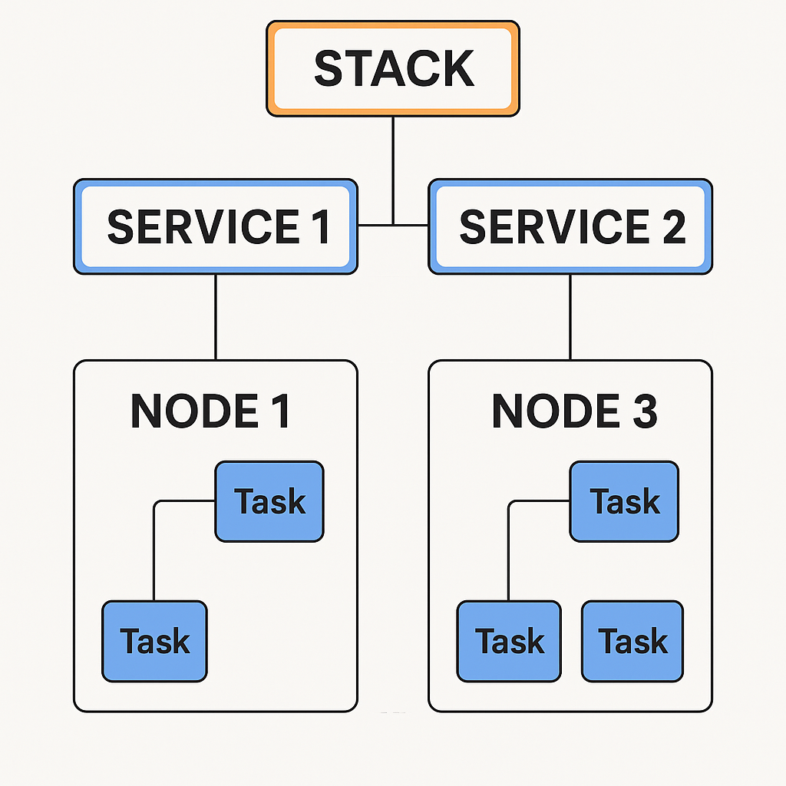

```shell
$ docker rm $(docker ps -a -q) || 1
$ docker image rm $(docker images -q) || 1
$ docker build 
```

```shell
$ docker compose -f docker-compose.dev.yml --env-file .env up -d --build
```

```shell
$ docker pull mongo
$ docker pull postgres
$ docker pull prom/prometheus
$ docker pull prom/alertmanager
$ docker pull grafana/grafana
$ docker pull maildev/maildev
```

```shell
$ docker swarm init --advertise-addr eth0
$ docker node ls
$ docker node update --label-add db=true docker-desktop
$ docker stack deploy -c stack.local.yml shop-dunn
$ docker service update --force stack_service_name

```

## SWARM
| Mục đích       | Lệnh                                              | Ý nghĩa                                                | Ví dụ nhanh                                        | Ghi chú debug                                       |          |
| -------------- | ------------------------------------------------- | ------------------------------------------------------ | -------------------------------------------------- | --------------------------------------------------- | -------- |
| Khởi tạo cụm   | `docker swarm init`                               | Biến host hiện tại thành **manager** và khởi tạo Swarm | `docker swarm init --advertise-addr 10.0.0.10`     | In ra token để node khác `join`                     |          |
| Tham gia cụm   | `docker swarm join`                               | Thêm node vào Swarm (worker/manager)                   | `docker swarm join --token <token> 10.0.0.10:2377` | Token lấy từ `docker swarm join-token worker        | manager` |
| Lấy token join | `docker swarm join-token`                         | Hiển thị/rotate token tham gia                         | `docker swarm join-token -q worker`                | Dùng `--rotate` để đổi token khi bị lộ              |          |
| Rời khỏi cụm   | `docker swarm leave`                              | Node rời Swarm                                         | `docker swarm leave`                               | Trên manager cuối cùng cần `--force`                |          |
| Trạng thái cụm | `docker info`                                     | Hiển thị chi tiết engine & Swarm                       | `docker info`                                      | Xem `Swarm: active`, số node, manager               |          |
| CA & chứng chỉ | `docker swarm ca`                                 | Quản lý CA của Swarm                                   | `docker swarm ca --rotate`                         | Rotate CA khi nghi ngờ bị lộ                        |          |
| Cấu hình Swarm | `docker swarm update`                             | Sửa tham số ở cấp cụm                                  | `docker swarm update --dispatcher-heartbeat 5s`    | Thay đổi timeout, rotate key tự động…               |          |
| Khóa/giải khóa | `docker swarm unlock-key` / `docker swarm unlock` | Quản lý khóa mã hóa Raft                               | `docker swarm unlock-key --rotate`                 | Bật autolock: `docker swarm update --autolock=true` |          |

## NODE
| Mục đích         | Lệnh                             | Ý nghĩa                             | Ví dụ nhanh                                                                      | Ghi chú debug                                                          |
| ---------------- | -------------------------------- | ----------------------------------- | -------------------------------------------------------------------------------- | ---------------------------------------------------------------------- |
| Liệt kê node     | `docker node ls`                 | Danh sách node, vai trò, trạng thái | `docker node ls --format '{{.ID}} {{.Hostname}} {{.Status}} {{.ManagerStatus}}'` | Cột `AVAILABILITY` (Active/Drain), `STATUS` (Ready/Down)               |
| Chi tiết node    | `docker node inspect`            | Thông tin & spec node (JSON)        | `docker node inspect node-1 --pretty`                                            | Xem label, engine, reachability                                        |
| Tác vụ trên node | `docker node ps`                 | Danh sách **tasks** chạy trên node  | `docker node ps node-1 --no-trunc`                                               | Hữu ích truy vết task restart/failed                                   |
| Cập nhật node    | `docker node update`             | Đổi availability/label/role         | `docker node update --availability drain node-1`                                 | `drain` để bảo trì, ngăn đặt mới task                                  |
| Thêm nhãn        | `docker node update --label-add` | Gắn label để ràng buộc đặt lịch     | `docker node update --label-add disk=ssd node-2`                                 | Dùng `--label-rm key` để gỡ                                            |
| Thăng/hạ cấp     | `docker node promote/demote`     | Đổi vai trò worker/manager          | `docker node promote node-2`                                                     | Cần quorum manager khỏe                                                |
| Xóa node         | `docker node rm`                 | Loại node khỏi cụm                  | `docker node rm node-3`                                                          | Nếu còn task/đang online: drain & remove, hoặc `--force` khi node chết |

## SERVICE
| Mục đích          | Lệnh                                  | Ý nghĩa                               | Ví dụ nhanh                                                                             | Ghi chú debug                                          |
| ----------------- | ------------------------------------- | ------------------------------------- | --------------------------------------------------------------------------------------- | ------------------------------------------------------ |
| Tạo service       | `docker service create`               | Khởi chạy service có thể scale        | `docker service create --name web --replicas 3 -p 80:80 nginx:alpine`                   | Thêm ràng buộc: `--constraint 'node.labels.disk==ssd'` |
| Liệt kê           | `docker service ls`                   | Danh sách service và số replica       | `docker service ls`                                                                     | So khớp DESIRED/TASKS để thấy thiếu/failed             |
| Nhiệm vụ (tasks)  | `docker service ps`                   | Trạng thái task theo service          | `docker service ps web --no-trunc`                                                      | Xem lý do fail, node đặt lịch                          |
| Chi tiết          | `docker service inspect`              | Spec & runtime của service            | `docker service inspect web --pretty`                                                   | Xem endpoint, networks, update policy                  |
| Log tập trung     | `docker service logs`                 | Gom log từ mọi replica                | `docker service logs -f --since 10m web`                                                | Dùng `--tail N`, `--timestamps` để phân tích sự cố     |
| Cập nhật          | `docker service update`               | Triển khai phiên bản mới/đổi cấu hình | `docker service update --image myapp:2.0 --update-parallelism 2 --update-delay 10s web` | Set chính sách rollback, healthcheck                   |
| Scale             | `docker service scale`                | Đổi số replica                        | `docker service scale web=10`                                                           | Hoặc `docker service update --replicas 10 web`         |
| Rollback          | `docker service rollback`             | Quay về phiên bản trước               | `docker service rollback web`                                                           | Yêu cầu có lịch sử update                              |
| Xóa               | `docker service rm`                   | Gỡ service khỏi cụm                   | `docker service rm web`                                                                 | Tasks sẽ bị thu hồi                                    |
| Gắn secret        | `docker service update --secret-*`    | Thêm/bớt secret vào container         | `docker service update --secret-add db_pass web`                                        | Tạo secret trước: `docker secret create`               |
| Gắn config        | `docker service update --config-*`    | Quản lý config file                   | `docker service update --config-add cfg.yml web`                                        | Tạo config: `docker config create`                     |
| Mạng              | `docker service create ... --network` | Chỉ định network overlay              | `--network frontend`                                                                    | Tạo trước: `docker network create -d overlay frontend` |
| Ràng buộc & prefs | `--constraint`, `--placement-pref`    | Điều khiển đặt lịch                   | `--constraint 'node.role==worker'`                                                      | Dùng label để phân vùng workload                       |

## CONTAINER
| Mục đích           | Lệnh                      | Ý nghĩa                         | Ví dụ nhanh                                                      | Ghi chú debug                                        |
| ------------------ | ------------------------- | ------------------------------- | ---------------------------------------------------------------- | ---------------------------------------------------- |
| Liệt kê container  | `docker ps`               | Container đang chạy             | `docker ps --format '{{.ID}} {{.Image}} {{.Names}} {{.Status}}'` | Thêm `-a` để thấy cả đã dừng                         |
| Xem log            | `docker logs`             | Log của 1 container             | `docker logs -f --since 10m <cid>`                               | Tìm lỗi cục bộ khi task fail                         |
| Vào shell          | `docker exec`             | Chạy lệnh trong container       | `docker exec -it <cid> sh`                                       | Hoặc `bash` nếu có                                   |
| Thông tin chi tiết | `docker inspect`          | JSON chi tiết container         | `docker inspect <cid>`                                           | Xem env, mounts, network, exit code                  |
| Tiến trình         | `docker top`              | Liệt kê process trong container | `docker top <cid>`                                               | Xem PID, CMD, user                                   |
| Tài nguyên         | `docker stats`            | Theo dõi CPU/RAM/NET I/O        | `docker stats --no-stream`                                       | Phát hiện container “ngốn” tài nguyên                |
| Dừng/giết          | `docker stop/kill`        | Kết thúc container              | `docker stop <cid>`                                              | Trong Swarm, service sẽ tạo lại task nếu còn replica |
| Sao chép file      | `docker cp`               | Copy file vào/ra container      | `docker cp <cid>:/var/log/app.log ./`                            | Hữu ích khi cần log/cores                            |
| Sự kiện            | `docker events`           | Stream event thời gian thực     | `docker events --since 1h`                                       | Lọc theo `--filter 'type=service'`/`container`       |
| Mạng               | `docker network inspect`  | Thông tin mạng                  | `docker network inspect <net>`                                   | Kiểm tra overlay, endpoints                          |
| Healthcheck        | (trong image) + `inspect` | Theo dõi kết quả health         | `docker inspect --format '{{.State.Health}}' <cid>`              | Ảnh hưởng đến rolling update trong service           |


## Flag
| Bối cảnh                | Flag                                                                | Tác dụng                      | Ví dụ                                                                        |
| ----------------------- | ------------------------------------------------------------------- | ----------------------------- | ---------------------------------------------------------------------------- |
| `service create/update` | `--update-parallelism`, `--update-delay`, `--update-failure-action` | Kiểm soát rolling update      | `--update-parallelism 2 --update-delay 10s --update-failure-action rollback` |
| `service create`        | `--restart-condition`, `--restart-max-attempts`, `--restart-window` | Chính sách restart            | `--restart-condition on-failure --restart-max-attempts 3`                    |
| `service create`        | `--limit-cpu`, `--limit-memory`, `--reserve-*`                      | Giới hạn/đặt trước tài nguyên | `--limit-memory 512m --reserve-memory 256m`                                  |
| `service create`        | `--constraint`, `--placement-pref`                                  | Ràng buộc & ưu tiên đặt lịch  | `--constraint 'node.labels.zone==az1'`                                       |
| `service create/update` | `--env`, `--secret`, `--config`, `--mount`                          | Cấu hình runtime              | `--mount type=volume,src=data,dst=/data`                                     |
